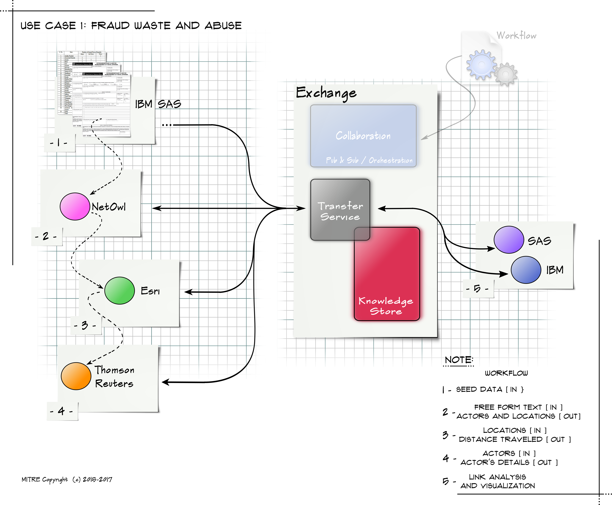

Use Case #1: Fraud, Waste and Abuse.
===================================
Focus is on fraud in travel voucher claims.
* **User Manual** -- https://analytic-roundtable.github.io/member-MITRE/doc/TangerineDemo.htm
* **Travel-Voucher-and-MedicalClaims-UseCase-v4.docx** -- full description of the use case and objectives.
* **Named_Products_Travel_Voucher_v3.pdf** -- end-to-end visual
* **Analysis-Exchange-Elements-for-TravelVoucher-Fraud,v3.docx** -- discussion of the AE Ontology  applied to this problem and data set.
* **Ingest_Samples.zip**  - sample data.

